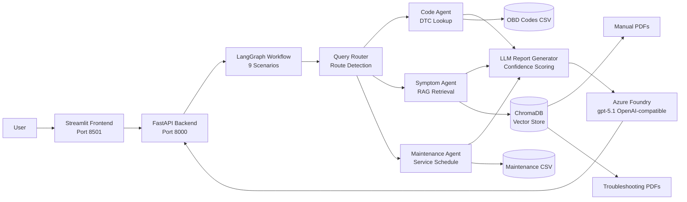

# Automotive Vehicle Diagnostics and Service Recommendation Assistant

A production-oriented GenAI assistant that diagnoses vehicle issues from DTC codes, symptoms, and vehicle context, then recommends repair and maintenance actions. Powered by Azure Foundry LLM (gpt-5.1) with intelligent confidence scoring.

## Architecture Diagram



## Tech Stack

- **Frontend**: Streamlit 1.48.0
- **Backend**: FastAPI 0.116.1
- **Agent Framework**: LangGraph 0.6.4
- **RAG Framework**: LangChain 0.3.27
- **LLM**: Azure Foundry gpt-5.1 (OpenAI-compatible endpoint)
- **Embeddings**: sentence-transformers/all-MiniLM-L6-v2
- **Vector DB**: ChromaDB 1.0.20
- **PDF Loader**: PyPDF 5.9.0
- **Containerization**: Docker, Docker Compose
- **Python**: 3.12 (Ubuntu), 3.13 (Windows)
- **Testing**: pytest 8.4.1

## Project Structure

```text
automotive-assistant/
  backend/
    app.py                      # FastAPI entrypoint
    agents/
      code_agent.py             # DTC code lookup
      symptom_agent.py          # Symptom RAG retrieval
      maintenance_agent.py      # Service recommendations
    graph/
      workflow.py               # LangGraph state machine (9 scenarios)
      state.py                  # Pydantic models & state schema
    rag/
      ingest.py                 # PDF ingestion to ChromaDB
      retriever.py              # Vector store queries
      embedding.py              # Embedding factory
    services/
      azure_openai_service.py   # LLM report generation & confidence scoring
  frontend/
    streamlit_app.py            # Streamlit UI (port 8501)
  data/
    obd/
      generic/                  # Generic OBD codes (all vehicles)
      toyota/                   # Toyota-specific OBD codes
      honda/                    # Honda-specific OBD codes
    maintenance/
      generic/                  # Generic maintenance schedules
      toyota/                   # Toyota-specific maintenance
      honda/                    # Honda-specific maintenance
    troubleshooting/
      generic/                  # Generic troubleshooting guides
      toyota/                   # Toyota-specific troubleshooting
      honda/                    # Honda-specific troubleshooting
  tests/
    test_api.py                 # FastAPI endpoint tests
    test_retrieval.py           # RAG retrieval tests
  TEST_SCENARIOS.md             # Manual test guide (20+ scenarios)
  requirements.txt              # Python dependencies (60+)
  .env.example                  # Environment template
  .env                          # (DO NOT COMMIT - sensitive credentials)
  Dockerfile                    # Docker image
  docker-compose.yml            # Multi-container setup
  README.md                      # This file
```

## Setup Instructions

1. Clone the repository and enter the project folder.
2. Create environment file:
   - `cp .env.example .env` (Linux/macOS)
   - `copy .env.example .env` (Windows CMD)
3. Fill Azure OpenAI credentials in `.env`.
4. Add TXT files to knowledge base:
   - `data/obd/generic/` - Generic OBD diagnostic codes
   - `data/obd/toyota/`, `data/obd/honda/` - Brand-specific OBD codes
   - `data/maintenance/generic/` - Generic maintenance schedules
   - `data/maintenance/toyota/`, `data/maintenance/honda/` - Brand-specific maintenance
   - `data/troubleshooting/generic/` - Generic troubleshooting guides
   - `data/troubleshooting/toyota/`, `data/troubleshooting/honda/` - Brand-specific troubleshooting

## Installation

```bash
python -m venv .venv
source .venv/bin/activate  # Windows: .venv\Scripts\activate
pip install -r requirements.txt
```

## Environment Variables

**Required (Azure Foundry LLM)**:
- `AZURE_OPENAI_ENDPOINT`: Azure Foundry endpoint with OpenAI-compatible format
  - Format: `https://<resource>.services.ai.azure.com/openai/v1`
  - Must end with `/openai/v1` (not `/openai/v1/responses`)
- `AZURE_OPENAI_API_KEY`: API key for authentication
- `AZURE_OPENAI_DEPLOYMENT`: Model deployment name (e.g., `gpt-5.1`)
- `AZURE_OPENAI_API_VERSION`: API version (e.g., `2025-11-13`)

**Optional (Data & Configuration)**:
- `BACKEND_URL`: Backend URL for frontend (default: `http://localhost:8000`)
- `CHROMA_PERSIST_DIR`: ChromaDB storage directory (default: `./data/chroma`)
- `CHROMA_COLLECTION_NAME`: Collection name (default: `automotive_docs`)
- `LOG_LEVEL`: Logging level (default: `INFO`)

**Note**: All embeddings use Azure OpenAI only. HuggingFace fallback has been completely removed for production deployment.

## Running Locally

### 1. Setup Environment

```bash
# Clone and navigate
cd automotive-assistant

# Create and activate virtual environment
python -m venv .venv
source .venv/bin/activate  # Windows: .venv\Scripts\activate

# Install dependencies
pip install -r requirements.txt
```

### 2. Configure Azure Foundry

```bash
# Copy environment template
cp .env.example .env  # Windows: copy .env.example .env

# Edit .env with your Azure Foundry credentials:
# AZURE_OPENAI_ENDPOINT=https://<resource>.services.ai.azure.com/openai/v1
# AZURE_OPENAI_API_KEY=<your-api-key>
# AZURE_OPENAI_DEPLOYMENT=gpt-5.1
# AZURE_OPENAI_API_VERSION=2025-11-13
```

### 3. Ingest Documents (Optional - for RAG)

```bash
# Add PDF files to data/manuals/ and data/troubleshooting/
python -m backend.rag.ingest
```

### 4. Run Backend

```bash
cd automotive-assistant
python -m uvicorn backend.app:app --host 0.0.0.0 --port 8000 --reload
```

Server: http://localhost:8000
API Docs: http://localhost:8000/docs

### 5. Run Frontend (in separate terminal)

```bash
cd automotive-assistant/frontend
streamlit run streamlit_app.py --server.port 8501 --server.address 0.0.0.0
```

Frontend: http://localhost:8501

### 6. Test Diagnosis

Open Streamlit UI and enter:
- Make: `Toyota`
- Model: `Corolla`
- Year: `2020`
- Diagnostic Code: `P0171`

Expected output: Confidence score 0.80-0.90 (with LLM enhancement)

## Docker Deployment

```bash
docker compose up --build
```

Services:
- Frontend: http://localhost:8501
- Backend: http://localhost:8000

## API Usage

### Health Check

```http
GET /health
```

Response:
```json
{
  "status": "ok"
}
```

### Diagnose Endpoint

```http
POST /diagnose
Content-Type: application/json
```

**Sample Request** (Code + Vehicle - Confidence 0.80-0.90):

```json
{
  "make": "Toyota",
  "model": "Corolla",
  "year": 2020,
  "mileage": 60000,
  "code": "P0171",
  "symptoms": "rough idle and poor fuel economy"
}
```

**Sample Response**:

```json
{
  "diagnosis": "System Too Lean (Bank 1) - Toyota Corolla 2020. Detected rich/lean condition indicating potential oxygen sensor malfunction, vacuum leak, or fuel system pressure issue specific to 2020 Corolla models.",
  "severity": "High",
  "possible_causes": [
    "Faulty oxygen sensor (common in Corolla)",
    "Vacuum leak in intake system",
    "Low fuel pressure from pump/regulator",
    "Dirty mass airflow sensor",
    "Fuel injector leaking"
  ],
  "repair_steps": [
    "Scan and confirm active/pending DTCs with freeze-frame data",
    "Inspect oxygen sensor connectors and wiring",
    "Check fuel pressure (Toyota spec: 44-50 PSI)",
    "Perform smoke test for vacuum leaks",
    "Replace oxygen sensor if faulty, clear codes, and re-scan",
    "Road test and verify lean condition resolved"
  ],
  "maintenance_recommendations": [
    "Oil change and filter replacement",
    "Air filter inspection and replacement if needed",
    "Spark plug inspection (if over 30k miles since replacement)"
  ],
  "confidence_score": 0.87,
  "sources": [
    {
      "source": "data/obd/toyota/Toyota_OBD_Codes.txt",
      "type": "obd_dataset",
      "code": "P0171"
    },
    {
      "source": "data/maintenance/toyota/Toyota_Maintenance_Schedules.txt",
      "type": "maintenance_dataset",
      "make": "Toyota",
      "model": "Corolla"
    }
  ]
}
```

**Note**: Confidence score reflects diagnostic certainty:
- **0.50-0.65**: Limited input data (code only, symptoms only)
- **0.70-0.80**: Partial context (code + symptoms, vehicle only)
- **0.80-0.95**: Rich context with LLM enhancement (code + vehicle, full diagnosis)

## Supported Input Scenarios

The system uses intelligent query routing to determine the best diagnostic path. **9 scenarios** are supported:

| # | Scenario | Input | Confidence Range | Route |
|---|----------|-------|-----------------|-------|
| 1 | Code Only | DTC code | 0.60-0.70 | `code_only` |
| 2 | Symptoms Only | Symptoms | 0.50-0.65 | `symptom_only` |
| 3 | Code + Symptoms | Both | 0.70-0.80 | `code_symptom` |
| 4 | **Code + Vehicle** ⭐ | Code + Make/Model/Year | **0.80-0.90** | `code_vehicle` |
| 5 | Vehicle + Mileage | Vehicle + Mileage | 0.55-0.65 | `vehicle_mileage` |
| 6 | Vehicle + Symptoms | Vehicle + Symptoms | 0.65-0.75 | `vehicle_symptom` |
| 7 | **Full Diagnosis** ⭐⭐ | All inputs | **0.85-0.95** | `full_diagnosis` |
| 8 | Maintenance Query | Text query | 0.70-0.80 | `maintenance_only` |
| 9 | Fallback | None/Invalid | 0.50 | `fallback` |

**LLM Confidence Boost**: Code + Vehicle and Full Diagnosis scenarios achieve higher confidence (0.80+) due to Azure Foundry gpt-5.1 LLM enhancement.

### Test Scenarios

Refer to [TEST_SCENARIOS.md](TEST_SCENARIOS.md) for 20+ manual test cases covering all scenarios with expected outputs.

## Testing

```bash
# Run all tests
pytest tests/ -v

# Run specific test module
pytest tests/test_api.py -v

# Run with coverage report
pytest --cov=backend tests/
```

## Production Deployment

### Before Deploying

- [ ] Configure secret management for Azure Foundry credentials
- [ ] Add additional brand-specific documents to `data/*/toyota/`, `data/*/honda/`, etc.
- [ ] Ingest troubleshooting PDFs to `data/troubleshooting/`
- [ ] Test with production vehicle data (various make/model/year combinations)
- [ ] Configure monitoring for low-confidence responses
- [ ] Extend maintenance dataset for additional make/model/year combinations
- [ ] Set up logging and error tracking (CloudWatch, Datadog, etc.)
- [ ] Use environment variables from secure vault (not .env file)

### Confidence Score Monitoring

- **0.50-0.65**: Low confidence (limited input) - may need manual review
- **0.65-0.80**: Medium confidence - acceptable for most scenarios
- **0.80+**: High confidence - ready for customer use (LLM enhanced)

## Known Limitations

- RAG quality depends on TXT ingestion quality and metadata accuracy
- System automatically extracts make/model from directory structure
- Brand-specific documents boost confidence when user vehicle info matches
- Corporate networks may block ChromaDB HuggingFace model downloads (fallback mode handles this)

## Troubleshooting

**LLM Connection Error**: Verify Azure Foundry endpoint format ends with `/openai/v1` (not `/responses`)

**Module Import Error**: Ensure project structure intact and `conftest.py` exists in tests folder

**ChromaDB Connection Error**: Check `CHROMA_PERSIST_DIR` path is writable, or RAG will gracefully skip

**Low Confidence Scores**: Add more vehicle/diagnostic context. Code + Vehicle alone achieves 0.80+

## Support

For issues or questions, refer to [TEST_SCENARIOS.md](TEST_SCENARIOS.md) for test cases and expected outputs.
