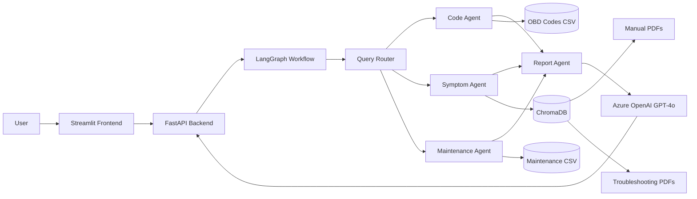

# Automotive Vehicle Diagnostics and Service Recommendation Assistant

A production-oriented GenAI assistant that diagnoses vehicle issues from DTC codes, symptoms, and vehicle context, then recommends repair and maintenance actions.

## Architecture Diagram



## Tech Stack

- Frontend: Streamlit
- Backend: FastAPI
- Agent Framework: LangGraph
- RAG Framework: LangChain
- LLM: Azure OpenAI GPT-4o
- Embeddings: sentence-transformers/all-MiniLM-L6-v2
- Vector DB: ChromaDB
- PDF Loader: PyPDFLoader
- Containerization: Docker, Docker Compose
- Python: 3.11

## Project Structure

```text
automotive-assistant/
  backend/
    app.py
    agents/
      code_agent.py
      symptom_agent.py
      maintenance_agent.py
      report_agent.py
    graph/
      workflow.py
      state.py
    rag/
      ingest.py
      retriever.py
      embedding.py
    routes/
      diagnose.py
    services/
      azure_openai_service.py
  frontend/
    streamlit_app.py
  data/
    manuals/
    troubleshooting/
    maintenance/
      maintenance.csv
    obd/
      obd_codes.csv
  tests/
    test_api.py
    test_retrieval.py
  Dockerfile
  docker-compose.yml
  requirements.txt
  .env.example
  README.md
```

## Setup Instructions

1. Clone the repository and enter the project folder.
2. Create environment file:
   - `cp .env.example .env` (Linux/macOS)
   - `copy .env.example .env` (Windows CMD)
3. Fill Azure OpenAI credentials in `.env`.
4. Add PDF manuals and troubleshooting documents under:
   - `data/manuals/`
   - `data/troubleshooting/`

## Installation

```bash
python -m venv .venv
source .venv/bin/activate  # Windows: .venv\Scripts\activate
pip install -r requirements.txt
```

## Environment Variables

- `AZURE_OPENAI_ENDPOINT`: Azure OpenAI endpoint URL
- `AZURE_OPENAI_API_KEY`: Azure OpenAI API key
- `AZURE_OPENAI_DEPLOYMENT`: deployment name for GPT-4o
- `AZURE_OPENAI_API_VERSION`: API version (default `2024-10-21`)
- `BACKEND_URL`: Frontend target for FastAPI
- `CHROMA_PERSIST_DIR`: local ChromaDB directory
- `CHROMA_COLLECTION_NAME`: Chroma collection name
- `EMBEDDING_MODEL`: sentence-transformer model
- `OBD_DATA_PATH`: path to `obd_codes.csv`
- `MAINTENANCE_DATA_PATH`: path to `maintenance.csv`
- `LOG_LEVEL`: logging level

## Running Locally

1. Ingest documents for retrieval:

```bash
python -m backend.rag.ingest
```

2. Run backend:

```bash
uvicorn backend.app:app --host 0.0.0.0 --port 8000 --reload
```

3. Run frontend:

```bash
streamlit run frontend/streamlit_app.py
```

4. Open:
- Streamlit: http://localhost:8501
- FastAPI docs: http://localhost:8000/docs

## Docker Deployment

```bash
docker compose up --build
```

Services:
- Frontend: http://localhost:8501
- Backend: http://localhost:8000

## API Usage

### Health

```http
GET /health
```

Response:

```json
{"status": "ok"}
```

### Diagnose

```http
POST /diagnose
Content-Type: application/json
```

Sample Input:

```json
{
  "make": "Toyota",
  "model": "Corolla",
  "year": 2020,
  "mileage": 60000,
  "code": "P0171",
  "symptoms": "rough idle and poor fuel economy"
}
```

Sample Output:

```json
{
  "diagnosis": "System Too Lean on Bank 1 with drivability symptoms indicating potential intake/fuel metering fault.",
  "severity": "High",
  "possible_causes": [
    "Vacuum leak",
    "Dirty MAF sensor",
    "Low fuel pressure"
  ],
  "repair_steps": [
    "Inspect intake hoses and PCV lines for leaks",
    "Validate MAF signal and clean sensor",
    "Measure fuel pressure and pump output"
  ],
  "maintenance_recommendations": [
    "Replace spark plugs (if applicable), inspect belts, flush brake fluid"
  ],
  "confidence_score": 0.78,
  "sources": [
    {
      "source": "data/obd/obd_codes.csv",
      "type": "obd_dataset",
      "code": "P0171"
    }
  ]
}
```

## Supported Input Scenarios

1. Diagnostic Code only
2. Symptoms only
3. Diagnostic Code + Symptoms
4. Vehicle + Mileage
5. Vehicle + Symptoms
6. Vehicle + Diagnostic Code + Symptoms + Mileage
7. Maintenance query only

## Testing

```bash
pytest -q
```

## Notes for Production

- Configure secret management for Azure keys.
- Ingest validated OEM manuals for improved retrieval quality.
- Add monitoring for low-confidence responses.
- Extend dataset coverage for make/model/year-specific service schedules.
